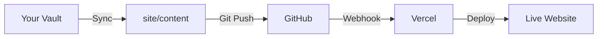

<div align="center">

# Vercel Publish for Obsidian

**Transform your Obsidian vault into a beautiful, published website with one command**

[](https://github.com/Yannaner/Vercel-Publish/releases)
[](LICENSE)
[](https://obsidian.md/plugins?id=vercel-publish)

[Features](#-features) • [Installation](#-installation) • [Quick Start](#-quick-start) • [Documentation](#-documentation) • [Contributing](#-contributing)

</div>

---

## Overview

Vercel Publish is an Obsidian plugin that seamlessly transforms your personal knowledge base into a professional website. With a single command, your notes are synced, optimized, and deployed to Vercel—perfect for digital gardens, documentation sites, or public knowledge bases.

### Why Vercel Publish?

- **One-Click Publishing** - Sync and deploy in seconds
- **Beautiful UI** - Modern Next.js template with dark mode support
- **Full-Text Search** - Find notes instantly with built-in search
- **Folder Structure** - Maintains your vault organization
- **Smart Link Conversion** - Wikilinks automatically converted to web-friendly URLs
- **Privacy First** - Choose exactly what to publish
- **Free Hosting** - Deploy to Vercel at no cost
- **Lightning Fast** - Static site generation for optimal performance

---

## Features

### Core Features

| Feature | Description |
|---------|-------------|
| **One-Command Publish** | Sync notes and push to GitHub with a single command |
| **Setup Wizard** | Guided step-by-step setup for non-technical users |
| **Wikilink Conversion** | Automatically converts `[[Note]]` links to proper markdown |
| **Folder Navigation** | Browse notes with a collapsible folder tree sidebar |
| **Dark Mode** | Beautiful dark/light theme toggle with persistence |
| **Search** | Real-time search across all published notes |
| **Template Updates** | Update your site template while preserving content |

### Privacy & Control

- **Selective Publishing** - Choose which folders to include/exclude
- **Default Exclusions** - Configuration folder (e.g. `.obsidian`), `private`, `journal` folders excluded by default
- **Custom Configuration** - Fine-grained control via `publish.config.json`

### Modern Tech Stack

- **Next.js 15** - React framework with App Router
- **TypeScript** - Type-safe development
- **Static Export** - Fast, secure, SEO-friendly pages
- **Vercel Edge** - Global CDN for instant page loads

---

## Installation

### From Obsidian Community Plugins

1. Open Obsidian Settings
2. Navigate to **Community Plugins** and disable **Safe Mode**
3. Click **Browse** and search for "Vercel Publish"
4. Click **Install**, then **Enable**

### Manual Installation

1. Download the latest release from [GitHub Releases](https://github.com/Yannaner/Vercel-Publish/releases)
2. Extract the files to your vault's plugins folder: `<vault>/.obsidian/plugins/vercel-publish/` (or your custom configuration folder)
3. Reload Obsidian
4. Enable the plugin in Settings → Community Plugins

---

## Quick Start

### 1. Initialize Your Website

Open the command palette (`Cmd/Ctrl+P`) and run:

```
Vercel Publish: Setup Wizard
```

The wizard will:
- Create a `/site` directory with a Next.js template
- Generate `publish.config.json` for customization
- Guide you through GitHub and Vercel setup

### 2. Configure What to Publish

Edit `publish.config.json` in your vault root:

```json
{
  "include": [],  // Empty = publish all notes (recommended)
  "exclude": [".obsidian", "site", "private", "journal"],
  "siteDir": "site",
  "contentDir": "site/content",
  "assetsDir": "site/public/assets",
  "baseRoute": "/notes",
  "slugStyle": "kebab"
}
```

> **Tip**: Leave `include` empty to publish all notes. Notes outside the `site` folder will automatically be synced.

### 3. Publish Your Notes

Run the publish command:

```
Vercel Publish: Publish (Sync + Push)
```

This command:
1. Syncs your notes to `/site/content`
2. Converts wikilinks to proper markdown links
3. Commits and pushes to GitHub
4. Triggers automatic Vercel deployment

### 4. Deploy to Vercel

1. Go to [vercel.com/new](https://vercel.com/new)
2. Import your GitHub repository
3. **Important**: Set **Root Directory** to `site`
4. Click **Deploy**

Your site will be live in minutes!

---

## Documentation

### Available Commands

| Command | Description | Shortcut |
|---------|-------------|----------|
| `Setup Wizard` | Guided setup for first-time users | - |
| `Initialize Website` | Create `/site` directory with Next.js template | - |
| `Sync Notes` | Copy notes to `/site/content` with link conversion | - |
| `Publish (Sync + Push)` | Sync notes and push to GitHub | - |
| `Update Template` | Update site template while preserving content | - |
| `Show Current Config` | Display current publish configuration | - |

### Configuration Options

#### `publish.config.json`

```typescript
{
  include: string[];    // Folders to include (empty = all)
  exclude: string[];    // Folders to exclude (default: config folder, site, private)
  siteDir: string;      // Site directory (default: "site")
  contentDir: string;   // Content directory (default: "site/content")
  assetsDir: string;    // Assets directory (default: "site/public/assets")
  baseRoute: string;    // Base URL path (default: "/notes")
  slugStyle: 'kebab' | 'original';  // URL slug style
}
```

### How It Works



1. **Sync**: Plugin copies markdown files to `site/content/` and converts wikilinks
2. **Push**: Changes are committed and pushed to GitHub
3. **Build**: Vercel receives webhook and builds the Next.js site
4. **Deploy**: Site is deployed to Vercel's global CDN

---

## Customization

### Update Site Template

Run the update command to get the latest features:

```
Vercel Publish: Update Template
```

This preserves your content and customizations while updating:
- UI components
- App logic
- Dependencies
- Configuration files

### Local Development

Test your site locally before publishing:

```bash
cd <vault>/site
npm install
npm run dev
```

Open [http://localhost:3000](http://localhost:3000) to preview.

---

## Troubleshooting

### Notes Not Syncing

1. Run `Vercel Publish: Show Current Config`
2. Check that `include` is empty `[]` or contains your note folders
3. Verify notes aren't in `exclude` list

### "Not a git repository"

Initialize git in your vault:

```bash
cd <vault>
git init
git add -A
git commit -m "Initial commit"
```

### "No git remote configured"

Add GitHub remote:

```bash
git remote add origin https://github.com/username/repo.git
```

### Vercel Build Fails

- Verify **Root Directory** is set to `site` in Vercel project settings
- Check build logs in Vercel dashboard
- Ensure `site/package.json` exists and has correct dependencies

### Dev Mode Errors

If you see errors like "missing param" in dev mode:
- These are harmless Next.js quirks with `output: 'export'`
- Production builds work perfectly
- Only affects `npm run dev`, not deployed site

---

## Contributing

We love contributions! Here's how you can help:

### Reporting Bugs

Open an issue with:
- Clear description of the problem
- Steps to reproduce
- Expected vs actual behavior
- Screenshots if applicable

### Suggesting Features

We're always looking for ways to improve! Open an issue with:
- Use case description
- Proposed solution
- Alternative approaches considered

### Pull Requests

1. Fork the repository
2. Create a feature branch: `git checkout -b feature/amazing-feature`
3. Make your changes
4. Run tests: `npm run build`
5. Commit: `git commit -m 'Add amazing feature'`
6. Push: `git push origin feature/amazing-feature`
7. Open a Pull Request

### Development Setup

```bash
# Clone the repo
git clone https://github.com/Yannaner/Vercel-Publish.git
cd Vercel-Publish

# Install dependencies
npm install

# Build the plugin
npm run build

# Development mode (auto-rebuild)
npm run dev
```

---

## License

This project is licensed under the MIT License - see the [LICENSE](LICENSE) file for details.

---

## Acknowledgments

- Built with [Obsidian Plugin API](https://github.com/obsidianmd/obsidian-api)
- Powered by [Next.js](https://nextjs.org/)
- Hosted on [Vercel](https://vercel.com/)
- Inspired by the amazing Obsidian community

---

<div align="center">

**[Back to Top](#vercel-publish-for-obsidian)**

Made by Ian

</div>
